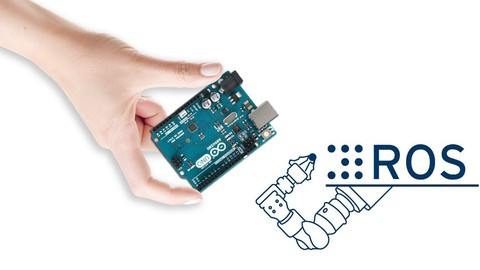

#🚀 ROS + Arduino Robot Project  
Project Mata Kuliah Robotika Medis by Dila Fadilatu, Faqih, & Angela Bertha

---

## 🧩 **Apa yang dilakukan di proyek ini?**
- Menghubungkan Arduino ke ROS menggunakan **rosserial**  
- Mengontrol aktuator (motor/servo) dari ROS  
- Membaca sensor (ultrasonic, encoder, dsb) dan mengirim datanya ke ROS  
- Membuat node ROS sederhana untuk komunikasi data  
- Menampilkan hasil pengujian robot

---

## 🔧 **Komponen Hardware**
- Arduino Uno / Mega  
- Motor Driver (L298N / BTS7960 / lainnya)  
- Sensor: Ultrasonic / IMU / Encoder  
- USB untuk komunikasi serial  
- Rangkaian robot / base

---
## 💻 **Software yang Digunakan**
- ROS (Noetic / Foxy / Humble)  
- Arduino IDE  
- rosserial_arduino  
- Python ROS Node

---
## 🏗️ **Arsitektur Sistem**
![Diagram]

Arduino bertindak sebagai microcontroller untuk membaca sensor dan menggerakkan aktuator.  
ROS mengolah data, memberikan perintah, dan menyediakan interface komunikasi.

---
## 📝 **Kode Arduino**
```cpp
#include <ros.h>
#include <std_msgs/String.h>

ros::NodeHandle nh;

void callback(const std_msgs::String& msg) {
    Serial.println(msg.data);
}

ros::Subscriber<std_msgs::String> sub("arduino_topic", callback);

void setup() {
Serial.begin(9600);
    nh.initNode();
    nh.subscribe(sub);
}

void loop() {
    nh.spinOnce();
    delay(10);
}
